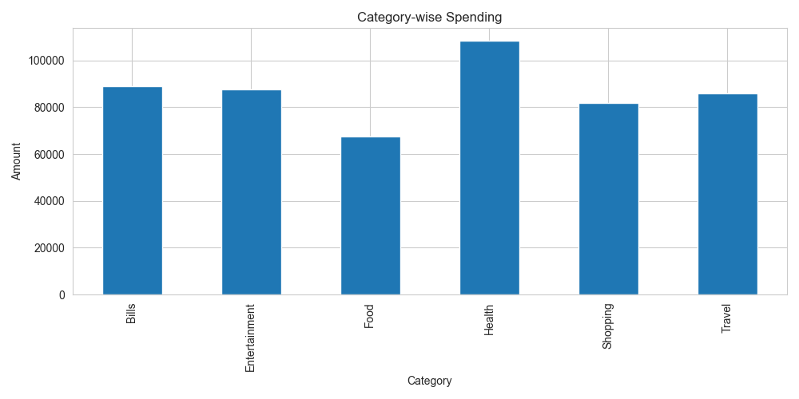
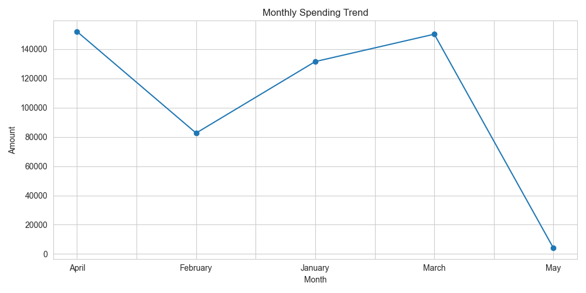
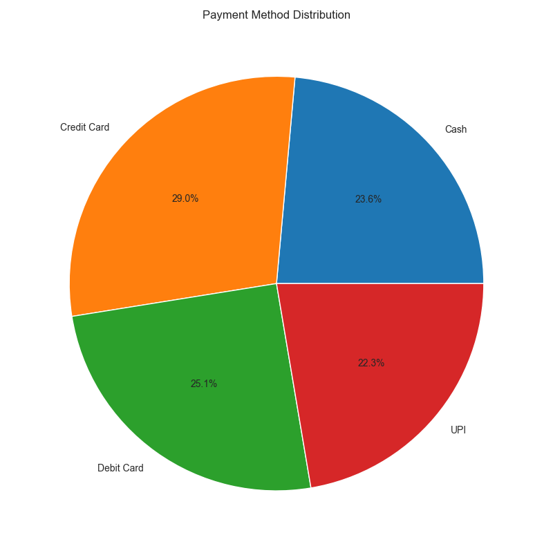
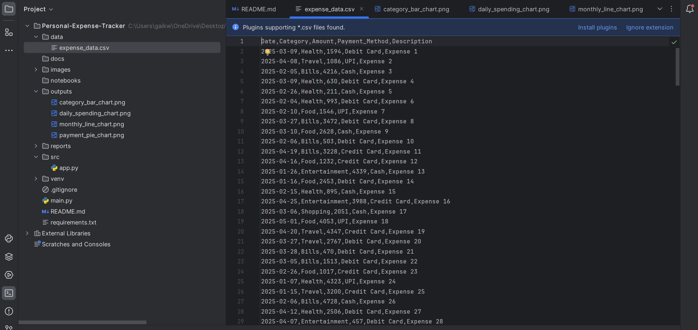
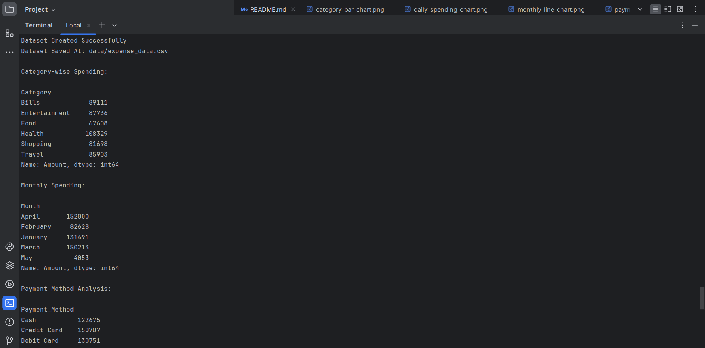
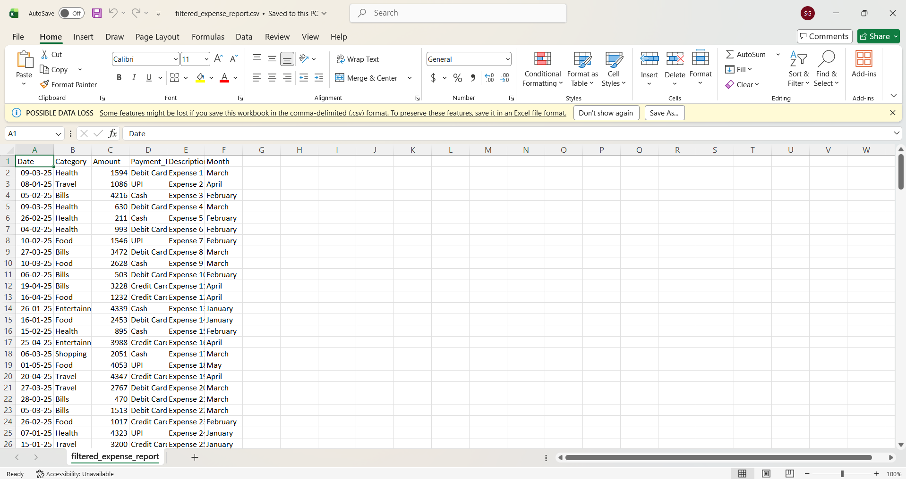

# 💸 Personal Expense Tracker with Data Visualization

A professional Python-based financial analytics project that helps users track, analyze, and visualize personal expenses using data analysis and interactive dashboards.

---

# 📌 Project Overview

Managing personal finances manually becomes difficult as daily transactions increase. This project solves that problem by automating expense tracking, spending analysis, visualization, and report generation.

The system allows users to:
- Record and analyze expenses
- Track spending habits
- Generate financial insights
- Visualize category-wise and monthly expenses
- Export reports for budgeting and planning


---

# 🚀 Features

## ✅ Expense Management
- Manual and CSV-based expense tracking
- Synthetic expense data generation

## ✅ Data Analysis
- Category-wise spending analysis
- Monthly spending trends
- Daily expense tracking
- Payment method analysis
- Highest spending category detection

## ✅ Data Visualization
- Bar charts
- Line charts
- Pie charts
- Daily spending trends

## ✅ Report Generation
- CSV summary reports
- Downloadable outputs

## ✅ Streamlit Dashboard
- Interactive dashboard
- CSV upload support
- Sidebar filters
- KPI metrics
- Dynamic visualizations

---

# 🏗️ Project Architecture

```text
Expense Data
     ↓
Data Cleaning
     ↓
Data Processing
     ↓
Financial Analysis
     ↓
Data Visualization
     ↓
Reports & Dashboard
```

---

# 🛠️ Tech Stack

| Technology | Purpose |
|---|---|
| Python | Core Programming |
| Pandas | Data Analysis |
| NumPy | Numerical Operations |
| Matplotlib | Data Visualization |
| Seaborn | Statistical Charts |
| Streamlit | Interactive Dashboard |
| SQLite | Database Storage |
| CSV | Data Storage |
| Git & GitHub | Version Control |

---

# 📂 Project Structure

```text
Personal-Expense-Tracker-Visualization/
│
├── data/
│   └── expense_data.csv
│
├── outputs/
│   ├── category_bar_chart.png
│   ├── monthly_line_chart.png
│   ├── payment_pie_chart.png
│   └── daily_spending_chart.png
│
├── reports/
│   └── expense_summary_report.csv
│
├── src/
│   └── app.py
│
├── images/
│
├── notebooks/
│
├── docs/
│
├── README.md
├── requirements.txt
├── main.py
└── .gitignore
```

---

# ⚙️ Installation Guide

## Step 1 — Clone Repository

```bash
git clone YOUR_REPOSITORY_LINK
```

---

## Step 2 — Navigate to Project

```bash
cd Personal-Expense-Tracker-Visualization
```

---

## Step 3 — Create Virtual Environment

### Windows

```bash
python -m venv venv
venv\Scripts\activate
```

### Mac/Linux

```bash
python3 -m venv venv
source venv/bin/activate
```

---

## Step 4 — Install Dependencies

```bash
pip install -r requirements.txt
```

---

# ▶️ Running the Project

## Run Main Python Script

```bash
python main.py
```

---

## Run Streamlit Dashboard

```bash
streamlit run src/app.py
```

---

# 📊 Dashboard Features

The Streamlit dashboard provides:

- Expense overview
- Interactive charts
- CSV upload
- Filtering options
- KPI metrics
- Financial insights

---

# 📈 Visualizations

The project generates the following charts:

| Chart | Description |
|---|---|
| Category-wise Bar Chart | Spending by category |
| Monthly Trend Chart | Monthly expense analysis |
| Payment Method Pie Chart | Payment distribution |
| Daily Spending Trend | Daily expense pattern |

---

# 📄 Generated Outputs

## Outputs Folder

```text
outputs/
```

Contains:
- PNG chart files
- Visualization outputs

---

## Reports Folder

```text
reports/
```

Contains:
- Expense summary CSV reports

---

# 📷 Screenshots

- Dashboard Homepage .png)
.png)
- Category-wise Spending Chart 
- Monthly Trend Chart 
- Payment Pie Chart 
- Expense Dataset Preview 
- Terminal Output 
- Report CSV 


---

# 🧠 Financial Insights Generated

The project identifies:
- Highest spending category
- Average daily spending
- Total expenses
- Payment trends
- Monthly spending behavior

---

# 🎯 Industry Relevance

This project demonstrates practical skills used in:
- Financial Analytics
- Business Intelligence
- Data Cleaning
- Data Visualization
- Dashboard Development
- Reporting Automation

---

# 📚 Learning Outcomes

Through this project, i learned:
- Python programming
- Data preprocessing
- Exploratory Data Analysis (EDA)
- Financial analytics
- Dashboard development
- Report generation
- GitHub project management

---

# 🔮 Future Improvements

Future enhancements may include:
- Budget tracking system
- AI-based expense categorization
- OCR bill scanning
- Database integration
- Authentication system
- Cloud deployment
- Mobile app integration
- Predictive expense forecasting

---

# 🧪 Sample Output

```text
Total Spending: ₹4,25,000
Average Daily Spending: ₹2,150
Highest Spending Category: Shopping
```

---

# 👨‍💻 Author

## Sagar Sanjay Gaikwad

M.Sc. Computer Science Student  
Python Developer | Data Analytics Enthusiast | Web Developer

---

# ⭐ If You Like This Project

Give this repository a ⭐ on GitHub and share it with others.